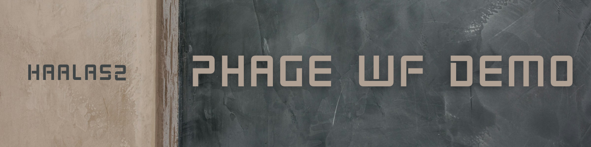
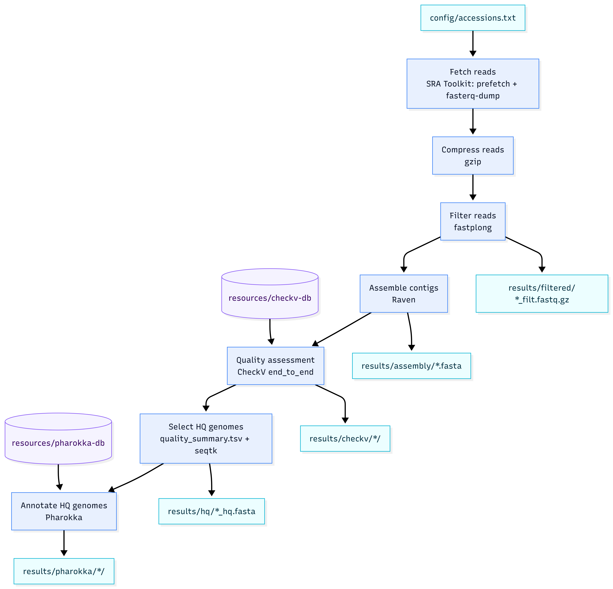

# PHAGE WF DEMO

Demo Snakemake workflow for phage discovery from Nanopore reads: filtering, assembly, quality assessment, and annotation.

## Pipeline Overview

The pipeline processes each sample accession through the following stages:

1. **Fetch reads**  
    Download input reads for each accession listed in the config.
2. **Filter reads**  
    Apply quality/length filtering (Fastplong).
3. **Assemble contigs**  
    Assemble filtered reads (Raven).
4. **Assess viral quality**  
    Evaluate completeness/contamination with CheckV.
5. **Select high-quality genomes**  
    Keep genomes that are predicted to be high quality (HQ).
6. **Annotate genomes**  
    Run Pharokka on selected HQ genomes.
7. **Merge HQ + annotation summary**  
    Merge HQ table with Pharokka MASH/Inphared top hits into per-accession merged TSV.

## Workflow Diagram



## Setup

1. Clone this repository.
2. Edit configuration:
    - `config/config.yaml`
    - `config/accessions.txt`
3. Run snakemake.

## Usage

```bash
# Dry run
snakemake --dry-run --use-conda --cores 8

# Full run
snakemake --use-conda --cores 8

# Rerun incomplete
snakemake --use-conda --cores 8 --ri

# Generate report
snakemake --report report.html
```

## Project structure

- `workflow/` – Snakemake rules, envs, helper scripts
- `config/` – run configuration and sample accession list
- `results/` – pipeline outputs by stage *(ignored by git)*
- `resources/` – tool-specific databases and DB check markers *(ignored by git)*
- `logs/` – per-step logs *(ignored by git)*

## Configuration

Edit `config/config.yaml` and `config/accessions.txt` before running.

## Requirements

- Snakemake >= 7.0
- Conda / Mamba
- Sufficient disk space for reads, assemblies, and databases

## Used Tools

- **Snakemake** – workflow orchestration  
    GitHub: https://github.com/snakemake/snakemake
- **SRA Toolkit** (`prefetch`, `fasterq-dump`) – read download  
    GitHub: https://github.com/ncbi/sra-tools
- **fastplong** – long-read filtering/QC  
    GitHub: https://github.com/OpenGene/fastplong
- **Raven** – long-read assembly  
    GitHub: https://github.com/lbcb-sci/raven
- **CheckV** – viral genome quality assessment  
    Bitbucket: https://bitbucket.org/berkeleylab/checkv
- **seqtk** – FASTA/FASTQ subsequence extraction (HQ contig selection step)  
    GitHub: https://github.com/lh3/seqtk
- **Pharokka** – phage genome annotation  
    GitHub: https://github.com/gbouras13/pharokka
